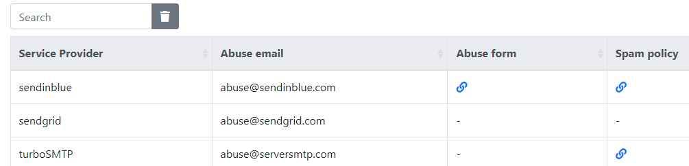

# Email service providers abuse contact list

    

 

&nbsp;  

Dataset containing abuse email, forms and policies for major ESP (email service providers).

Inspired from a [spam resource article](https://www.spamresource.com/2020/07/quick-list-esp-abusespam-contact-list.html).

## What is it?
This list contains all the contact information to report spam or abusive content to email delivery services.
Most of the providers have a standard abuse email for the reports (RFC 2142), some a dedicated web form, sometimes they provide both.

The dataset is formatted in JSON to allow easy parsing.

Note: You can visit  [abuse.net](https://abuse.net) to find most of abuse email contacts.

Contributions are welcome !

## Description
This Json version is an array of objects of the following shape:
- name
- abuse email (optional)
- online report form URL (optional)
- spam policy URL (optional)
